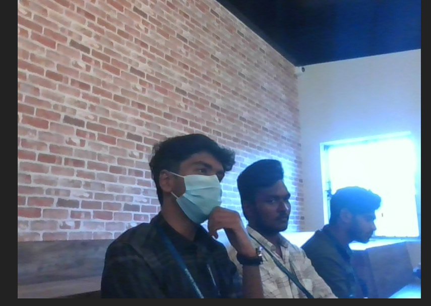
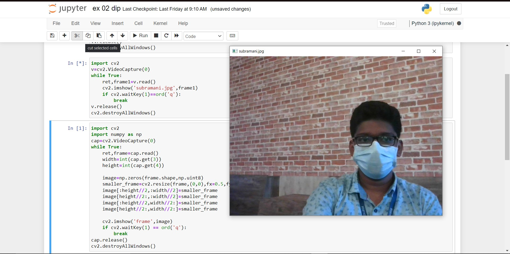
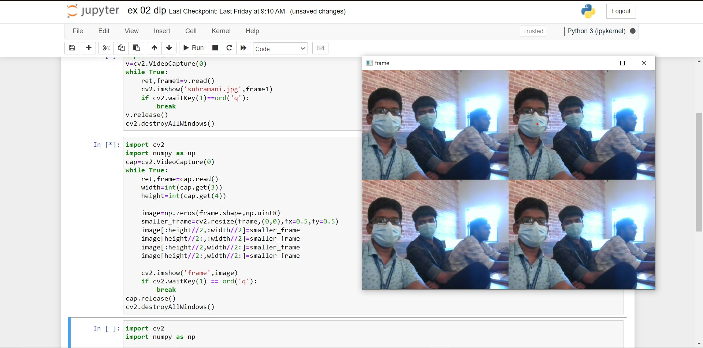
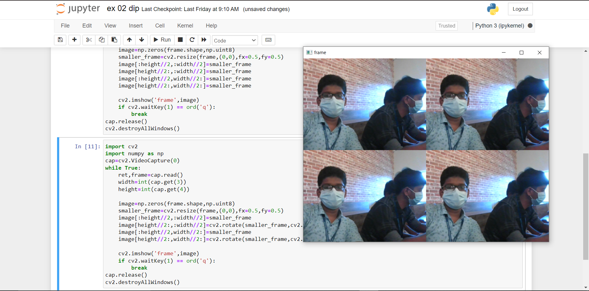

# Image-Acquisition-from-Web-Camera
## Aim

To write a python program using OpenCV to capture the image from the web camera and do the following image manipulations.
i) Write the frame as JPG 
ii) Display the video 
iii) Display the video by resizing the window
iv) Rotate and display the video

## Software Used
Anaconda - Python 3.7
## Algorithm
### Step 1:
Open Jupyter Notebook in the suitable environment using anaconda navigator.

### Step 2:
Create a new folder, in that create new python kernel file.

### Step 3:
Use VideoCapture(0) to use the camera.

### Step 4:
After executing each code use release() to close the camera.

### Step 5:
Close the each window frame after the result using the ordered waitkey

## Program:

### Developed By:SUBRAMANIYA PILLAI.B
### Register No:21221230109

## i) Write the frame as JPG file
```
import cv2
v=cv2.VideoCapture(0)
while True:
    ret,frame1=v.read()
    cv2.imwrite('subramani.jpg',frame1)
    if cv2.waitKey(1)==ord('q'):
        break
v.release()
cv2.destroyAllWindows()   
```
## ii) Display the video
```
import cv2
v=cv2.VideoCapture(0)
while True:
    ret,frame1=v.read()
    cv2.imshow('subramani.jpg',frame1)
    if cv2.waitKey(1)==ord('q'):
        break
v.release()
cv2.destroyAllWindows()    
```
## iii) Display the video by resizing the window
```
import cv2
import numpy as np
cap=cv2.VideoCapture(0)
while True:
    ret,frame=cap.read()
    width=int(cap.get(3))
    height=int(cap.get(4))
    
    image=np.zeros(frame.shape,np.uint8)
    smaller_frame=cv2.resize(frame,(0,0),fx=0.5,fy=0.5)
    image[:height//2,:width//2]=smaller_frame
    image[height//2:,:width//2]=smaller_frame
    image[:height//2,width//2:]=smaller_frame
    image[height//2:,width//2:]=smaller_frame
    
    cv2.imshow('frame',image)
    if cv2.waitKey(1) == ord('q'):
        break
cap.release()
cv2.destroyAllWindows()
```
## iv) Rotate and display the video
```
import cv2
import numpy as np

cap=cv2.VideoCapture(0)

while True:
    ref,frame1=cap.read()
    width=int(cap.get(3))
    height=int(cap.get(4))q
    
    image = np.zeros(frame1.shape,np.uint8)
    smaller_frame=cv2.resize(frame1,(0,0),fx=0.5,fy=0.5)
    image[:height//2, :width//2]=cv2.rotate(smaller_frame,cv2.ROTATE_180)
    image[height//2:, :width//2]=smaller_frame
    image[:height//2, width//2:]=smaller_frame
    image[height//2:, width//2:]=cv2.rotate(smaller_frame,cv2.ROTATE_180)

    
    cv2.imshow('frame',image)
    if cv2.waitKey(1)==ord('l'):
        break
cap.release()
cv2.destroyAllWindows()
```
## Output

### i) Write the frame as JPG image


### ii) Display the video


### iii) Display the video by resizing the window


### iv) Rotate and display the video


## Result:
Thus the image is accessed from webcamera and displayed using openCV.
